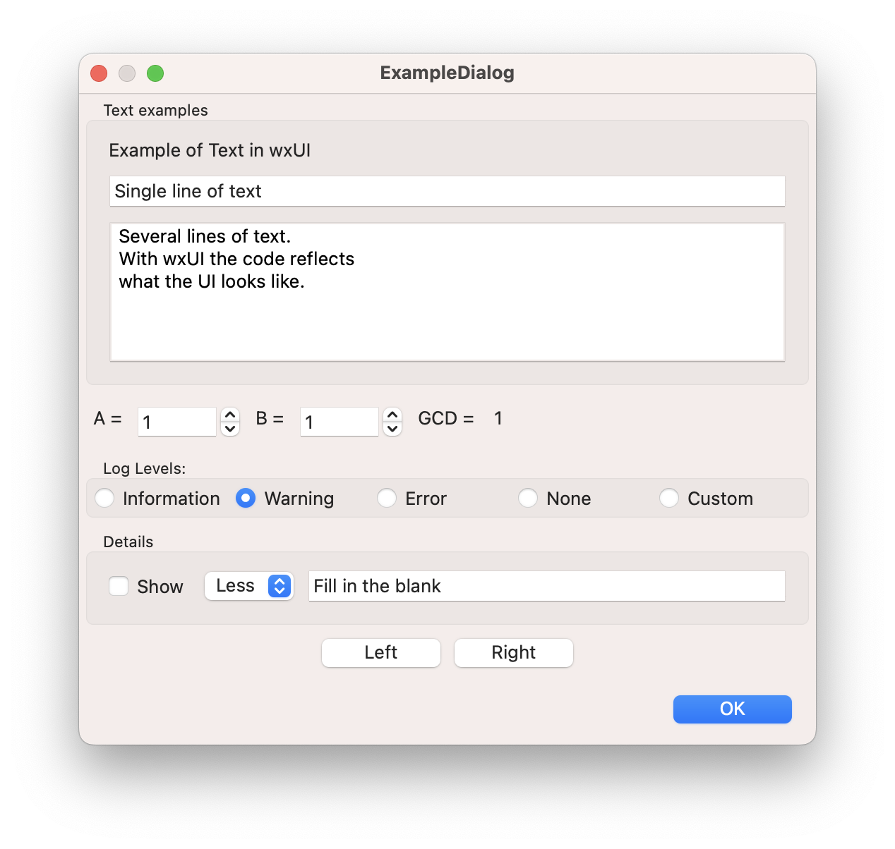

# wxUI
C++ header-only library to make declarative UIs for wxWidgets.

## Quick Start

```cpp
#include <wx/wx.h>
#include <wxUI/wxUI.h>

class ExampleDialog : public wxDialog
{
public:
    ExampleDialog(wxWindow* parent);
};


ExampleDialog::ExampleDialog(wxWindow* parent)
        : wxDialog(parent, wxID_ANY, "ExampleDialog",
                   wxDefaultPosition, wxDefaultSize,
                   wxDEFAULT_DIALOG_STYLE | wxRESIZE_BORDER)
{
    using namespace wxUI;

    // Create the controls.
    VStack{ wxUI::Sizer::ExpandBorder(),
        VStack{ "Text examples",
            Text{ "Example of Text in wxUI" },
            TextCtrl{ "Single line of text" }
                .style(wxALIGN_LEFT),
            TextCtrl{
                    "Several lines of text.\n"
                    "With wxUI the code reflects\n"
                    "what the UI looks like."}
                .style(wxTE_MULTILINE)
                .withMinSize(wxSize(200, 100))
        },
        RadioBox{ "&Log Levels:", {
            "&Information",
            "&Warning",
            "&Error",
            "&None",
            "&Custom"
        }}
            .style(wxRA_SPECIFY_ROWS)
            .majorDim(1)
            .withSelection(1),

        HStack{ "Details",
            CheckBox{ "Show" },
            Choice{ {"Less", "More" } },
            TextCtrl{ wxUI::Sizer::ExpandBorder<1>(), "Fill in the blank" }
                .style(wxALIGN_LEFT),
        },

        HStack{ wxUI::Sizer::CenterBorder(),
            Button{ wxUI::Sizer::RightBorder(), "Left" }
                .bind([](wxCommandEvent&){wxLogMessage("Pressed Left"); }),
            Button{ wxUI::Sizer::LeftBorder(), "Right" }
                .bind([](wxCommandEvent&){wxLogMessage("Pressed Right"); }),
        },

        Generic { CreateStdDialogButtonSizer(wxOK) }
    }
    .asTopLevel(this);
}
```



## Motivation
This library grew out of work to create a C++ library that allowed a simple declarative style for [`wxWidgets`](https://www.wxwidgets.org) to create the UI for the [CalChart](https://github.com/calband/calchart) project.  

[`wxWidgets`](https://www.wxwidgets.org) is a C++ library that lets developers create applications for Windows, macOS, Linux and other platforms with a single code base.  The programmer creates "UI Elements" such as [`wxControl`](https://docs.wxwidgets.org/3.2/classwx_control.html) elements and inserts them in [`wxSizer`](https://docs.wxwidgets.org/3.2/classwx_sizer.html) objects to describe the layout of the UI in code.  While this is descriptive of the UI, it is generally not as declarative as something like [SwiftUI](https://developer.apple.com/xcode/swiftui/).

For instance, a usual programming pattern for [`wxWidgets`](https://www.wxwidgets.org) is to create the UI objects first, and then put them in a layout: 

```
void ExampleDialog::CreateControls()
{
    // Create the controls.
    auto text = new wxStaticText(this, wxID_ANY, "Example of Text");
    auto textTitle = new wxTextCtrl(this, wxID_ANY, "Single line of text");

...

    // Layout the controls.
    auto sizer = new wxBoxSizer(wxVERTICAL);

    sizer->Add(text, wxSizerFlags().Expand().Border());
    sizer->Add(textTitle, wxSizerFlags().Expand().Border());
}
```

This separates the "what" from the "where", and often makes it challenging to identify what the structure of the UI will be from code inspection.

`wxUI` is a library that allows the user to declare a number of elements in a "struct-like" declaration that creates a "factory" that manufactures at runtime the ownership and sizer heirarchy.


```
void ExampleDialog::CreateControls()
{
    using namespace wxUI;

    VStack(Sizer::ExpandBorder()
        Text{ "Example of Text" };
        TextCtrl{ "Single line of text" };
            .style(wxALIGN_LEFT}
    }
    .asTopLevel(this);

}
```

`wxUI` is not intended to be a replacement for `wxWidgets`, but instead is a library to simplify usage.  It is written such that it should be easy to "step outside" of `wxUI` and access `wxWidgets` directly.

Please consult the [Programmer's Guide](docs/ProgrammersGuide.md) for more information on Library details.

## Installation


## Attributions


## Contact Info


